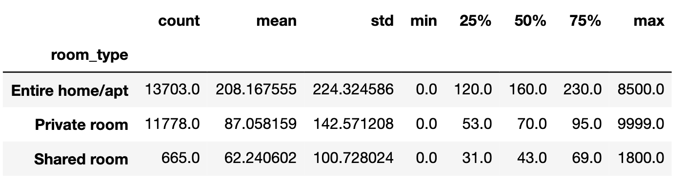
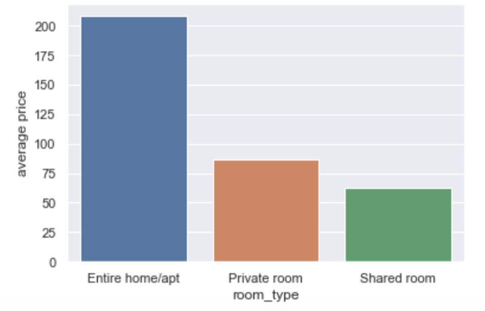
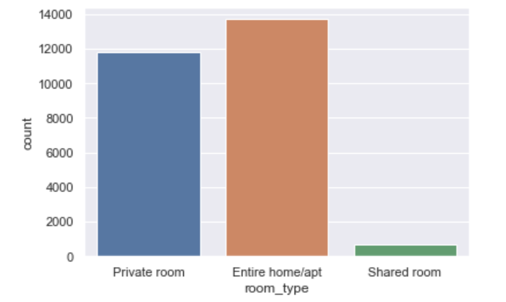
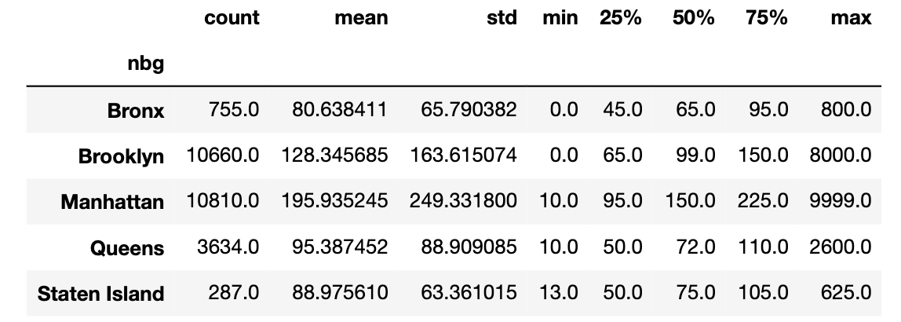
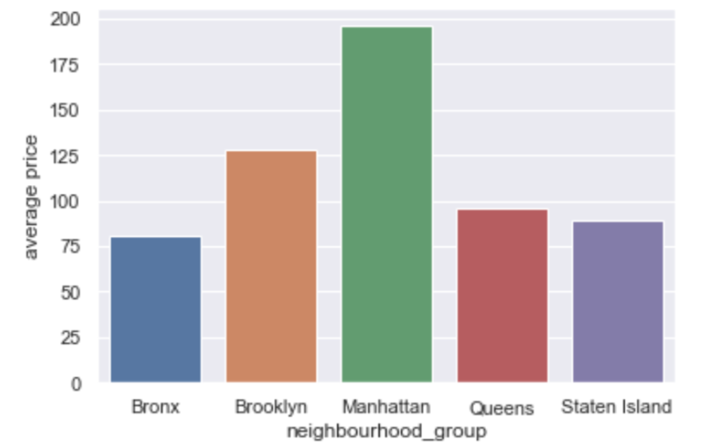
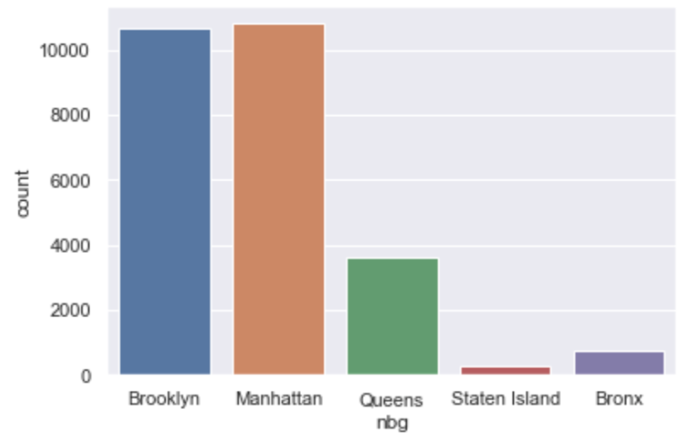
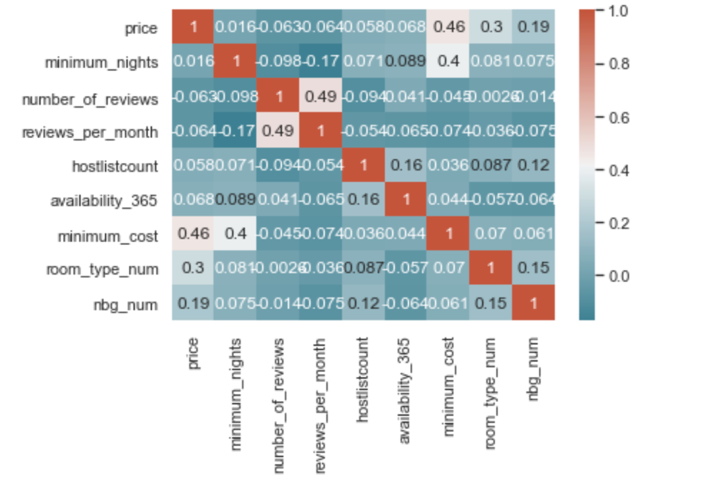
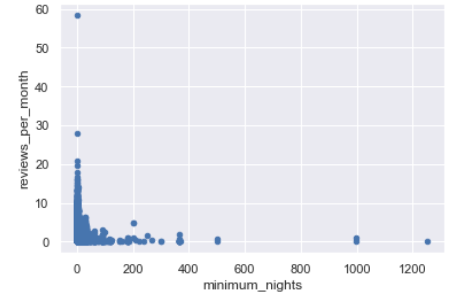
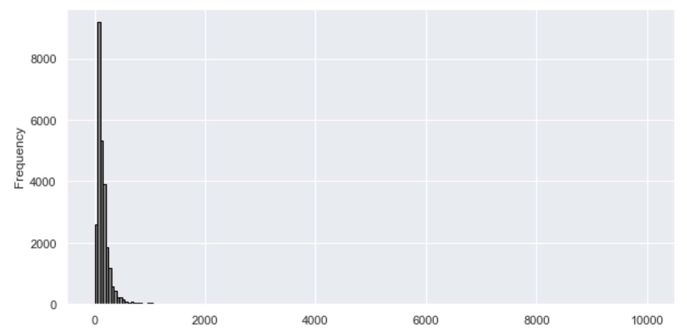

## Data cleaning and preprocessing
First, we loaded the data and drop the rows that include NA. The columns like id, host_id, last_review, are just website records, which do not relate to our analysis. The variable column latitude, longitude can be substituted by neighbourhood group. The rooms that are not available throughout the year can be ignored. We did this by selecting the rows which 'availability_365' are greater than zero. For many users, the question jump to their mind when they browse the list is "How much should I pay at least if I choose this room?". To provide information for users, we assign a new variable "minimum_cost", by multiplying "minimum nights" and "price". Finally, we noticed the variable name of 'neighbourhood group", "neighbourhood" and "calculated_host_listings_count" are too long, which may cause inconvenience when we call them in our functions. We rename them as "nbg","nb" and "hostlistcount".
## Which room type is the most/least popular?
By aggregating the data by room type group using **groupby** function, and summarying data via **describe** function, we can see the count, mean price, standard deviation, min, max, etc. 

From the table, entire room/apt is the most expensive with an average price of 208.167, and shared room is the cheapest with an average price of 62.24. Although entire home/apt costs more, most users prefer it. 

The bar plot shows the average price of each room type. We can see that the price ranking(from the **highest** to **lowest** is *entire room/apt > private room > shared room*

From the countplot, we can see that the popularity (from **most** to **least**), is *entire room/apt > private room > shared room*. The result indicates that price is just one of the factors people take into consideration when travel to NYC-although entire room/apt costs more, it usually provides better living experiences.
## Which area is the most/least popular?
Repeat the above process, but this time the data is grouped by "neighbourhood group". 

The result shows that the most expensive area in NYC is Manhattan, with an average rental price of 195.935, and the cheapest area is Bronx, with an average rental price of 80.638. Most of the people choose Brooklyn, the second expensive area in NYC. 

From the barplot, we can find the rank of average rental price: *Manhattan > Brooklyn > Queens > Bronx > Staten Island*. The price of Manhatten is much higher than the other neighbourhood groups.

From the countplot, we find that people are more willing to go to Manhattan and Brooklyn, which account for more than 50% of the total records. The popularity ranking of neighbourhood is: *Mahattan > Brooklyn >> Queens >Bronx >Staten Island*.
## What is the correlation between the variables?
We initially speculate that room type column and neighborhood column must be related to the price column, since better living experience almost always leads to a higher price. To explore the correlation, we first need to convert the categorical variable "room_type" and "nbg" to numeric variables.
The number for different room_type is:

- Entire room/apt:3
- Private room: 2
- Shared room: 1

The number for different nbg is:

- Manhattan:5
- Brooklyn:4
- Queens:3
- Staten Island:2
- Bronx:1

Then we did a correlation matrix heatmap to visualize the strength of correlation:

The heatmap shows that if we set the threshod at 0.15, the correlation between number of reviews and reviews per month(0.49), price and minimum cost(0.46), minimum nights and minimum cost(0.4), price and room type(0.3), price and neighbourhood group(0.19), and minimum nights and review per month(0.17) is strong.
The number of reviews and reviews per month must be related, since reviews per month is calculated based on number of reviews. The reason is same for price and minimum cost, minimum nights and minimum cost. The relationships which are worth investigating is price and room type, price and neighbourhood group, minimum nights and review per month.
## What is the relationship between reviews per month and minimum nights?
Since room type and neighbourhood group are categorical variables, we cannot explore the relationship between them from a regression perspective. However, reviews per month and minimum nights are both numeric variables, we can investigate the relationship through scatterplots:

From the plots, we can see that there is a negative correlation between reviews per month and price, minimum nights has a dimishing effect on reviews per month. That makes sense since most of the travellers are just looking for a short rent, if the minimum nights requirement is high, people are usually unwilling to look through.
## Is the price normally distributed?
The normal distribution is the most important probability distribution in statistics because it fits many natural phenomena. In this case, we want to know if the price follow a normal distribution? We explore this through the histogram of price.

We can see that the distribution of price is positively skewed. Although lots of models assume the variables are normally distributed, typically it is not the case.
